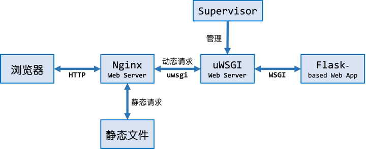

# 环境需求
* Linux  
Windows系统可以使用Cygwin，已测试✅
* Python3

# 功能介绍
这是一个基于Python Flask框架编写的Web应用，用于收集课程的班级作业。  
本App使用Nginx配合uWSGI作为Web服务器，同时使用Supervisor对uWSGI进行管理。Nginx只响应从指定端口进入的请求，因此服务可以比较安全地挂在公网上。国内很多云服务提供商都有云服务器免费体验的活动，虽然配置不高，但运行该应用（收集一个班的作业）完全足够。  
本项目的Nginx配置中采取了限流措施，当Nginx服务器触发限流时，网页会返回503错误，此时可以刷新网页重试。此外，脚本和uWSGI的配置文件中设置了服务的进程数和线程数，可以自行修改。  

整体结构如下图所示： 


网页运行图（PC端/移动端）：


# 安装方法
## 1. 创建一个Python虚拟环境
（也可以不使用虚拟环境，但建议在虚拟环境中操作）
```
pip3 install virtualenv
virtualenv ~/app_env  # 虚拟环境的路径和名称也可以自己指定
cd ~/app_env
source bin/activate  # 激活该虚拟环境，激活成功后命令行会出现 (app_env) 字样
```
若之后想要取消激活，直接在命令行输入```deactivate```命令即可。

## 2. 安装Nginx, uWSGI, uwsgitop和Supervisor

* Linux：  
（CentOS可以使用yum安装Nginx）
```
sudo apt update
sudo apt install nginx
pip3 install uwsgi uwsgitop supervisor
```

* Cygwin：  
首先安装Nginx，Cygwin安装Nginx的步骤[见此](#Cygwin安装Nginx)。  
接着，使用[apt-cyg](https://github.com/transcode-open/apt-cyg)或者原生的包管理器安装```python3-devel```和```libintl-devel```包。下一步安装过程中，编译whl文件时需要用到。  
最后，安装uWSGI, uwsgitop和Supervisor：
```
pip3 install uwsgi uwsgitop supervisor
```

## 3. 下载本项目到虚拟环境目录；安装Python依赖包
```
git clone https://github.com/NewComer00/NJUST_HomeworkCollector.git ./app
cd app
pip3 install -r requirements.txt
```

## 4. 给“应用管理”脚本添加执行权限
```
chmod +x app_manager.sh
```

# 使用方法
⚠️⚠️⚠️若使用了虚拟环境，请先确保虚拟环境已经激活⚠️⚠️⚠️  
觉得麻烦的话，可以将激活环境命令加入app_manager脚本```export APP_ROOT=...```这行之后：
```
source ${APP_ROOT}/../bin/activate
```
* Cygwin:  
```app_manager.sh```脚本用到了```envsubst```命令，Cygwin需要安装```gettext```包来获取这个命令。

## 启动应用
```
./app_manager.sh [options] start
```
启动命令示例（不指定```-p <数字>```，使用默认8080端口）：
```
./app_manager.sh -n 0 -b "测试提交页面" start
```
⚠️注：
1. ```[options]```必须放在```start```等命令**之前**才会生效。
2. ```[options]```代表可选参数，具体如下：  
```-n <数字>```<数字>表示这是<第几次>交作业，如1表示第一次。该参数的默认值为```1```。  
```-b <字符串>```<字符串>作为网页的<一级标题>。该参数的默认值为```"2021 云数据管理课程"```。  
```-p <数字>```<数字>表示网页服务所在的<端口号>。该参数的默认值为```8080```。

启动后可以在浏览器中访问网站：
```
http://<机器的ip地址>:<端口号>/
```
⚠️注：  
1. 在执行start命令后，Nginx可能会提示一些文件或目录无法找到。如果提示以```[alert]```开头，这只是一个警告，Nginx正常启动，可以不用管它。如果提示以```[emerg]```开头，代表这是一个紧急情况，Nginx启动失败，需要根据错误提示操作。
2. 上传文件后，项目根目录下会多出```uploads/```和```database/```目录。```uploads/x```目录存放了第x次提交作业的文件，```database/x```目录存放着第x次提交作业的提交记录，x为启动时用```-n```指定的数字。
3. 若提交文件后出现```CSRF token invalid``` 报错横幅，表示当前页面的CSRF令牌已经过期，刷新一下页面，重新提交即可。

## 关闭应用
```
./app_manager.sh stop
```
执行后，关闭所有相关进程。

## 重启应用
在应用**已经启动**的情况下，若应用的源码或者配置被修改，可以执行重启操作来使改动生效：
```
./app_manager.sh [options] restart
```
⚠️注：重启操作必须在应用**已经启动**的情况下才能正确执行。可以通过```top -U <用户名>```的方式查看用户当前运行进程。

# 日志与监控
应用启动后，Nginx, uWSGI和Supervisor的运行日志位于```logs/```目录下，在应用无法正常运行时可供参考。  
Python程序本身的输出和报错不在命令行显示，被重定向并保存至uWSGI相关的日志中。在Nginx和uWSGI的日志中可以查看服务器收到的请求信息。  
  

使用uwsgitop可以查看当前网站服务的负载情况，监控端口在uWSGI的配置文件中默认为5001：
```
uwsgitop http://localhost:5001/
```

# 附录
## Cygwin安装Nginx
1. 以管理员身份运行Cygwin。

2. 使用[apt-cyg](https://github.com/transcode-open/apt-cyg)或者原生的包管理器安装```cygrunsrv```和```nginx```包。

3. 执行```cygserver-config```命令，在交互时输入```yes```。

4. 安装Nginx的后台程序：
```
/etc/rc.d/init.d/nginx install
```
可能会提示一些路径不存在，但只要最后输出“done”，即表示成功。

5. 安装好的后台程序位于```/usr/sbin/nginx```。  
将```/usr/sbin```添加至Cygwin的环境变量：
```
export PATH="$PATH:/usr/sbin"
# 这是临时方法，为避免麻烦可以考虑将这句加入app_manager脚本开头
```
6. 运行帮助指令：
```
nginx -h
```
若正常输出版本信息和帮助信息，即安装成功。

参考：https://www.cnblogs.com/lantor/p/13829773.html
